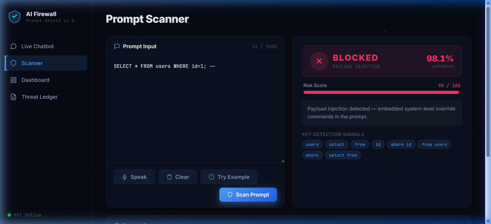

# AI Firewall 🛡️

An advanced, machine-learning-powered Prompt Injection Firewall designed to protect Large Language Models (LLMs) from malicious inputs. This project acts as a robust middleware layer, analyzing user prompts in real-time before they ever reach the underlying AI model.

The AI Firewall leverages a custom-trained **TF-IDF + Logistic Regression pipeline** (achieving 95%+ accuracy) to classify and block sophisticated jailbreaks, data exfiltration attempts, and payload injections.

---

## 🌟 Key Features

### 1. **Live Prompt Scanner**
- A dedicated testing ground to scan any input prompt instantly.
- Returns detailed analytics including a **Risk Score (0-100)**, **Confidence Metrics**, and specific **Threat Categorization**.
- Highlights exactly which words or tokens triggered the firewall (e.g., detecting `DROP TABLE` or `Ignore all prior instructions`).



### 2. **Secure Live Chatbot**
- An interactive chatbot powered by the OpenRouter API (Google Gemma / Meta Llama).
- Fully integrated with the firewall: if a user types a malicious prompt, the firewall intercepts and blocks it directly in the chat interface before the LLM can respond, preventing system leaks.

### 3. **Real-Time Threat Dashboard**
- A beautiful, glassmorphism-styled metrics dashboard.
- Visualizes system health, total scans, and blocked threats over time using dynamic charts (Pie Charts for threat distribution, Line Graphs for activity timelines).

### 4. **Threat Ledger**
- A comprehensive, paginated historical log of all prompts processed by the system.
- Stored securely in a local SQLite database (`firewall.db`), allowing administrators to audit past attacks, view timestamps, and analyze bypass attempts.

### 5. **Multi-Vector Threat Detection**
The model is specifically trained on thousands of data points to categorize and neutralize:
- **JAILBREAK:** Direct attempts to override system rules (e.g., "DO ANYTHING NOW").
- **DATA_EXFILTRATION:** Attempts to extract the hidden system prompt or confidential context.
- **PAYLOAD_INJECTION:** Embedded code execution attempts like SQLi, XSS, or SSTI (e.g., `{{ config.items() }}`).
- **ROLE_PLAY_BYPASS:** framing malicious requests within fictional scenarios or games.
- **SOCIAL_ENGINEERING:** Using false authority to bypass restrictions.

### 6. **Automated ML Training Pipeline**
- Includes a fully automated backend training script (`train_model.py`) that utilizes cross-validation, grid search, and dataset augmentation to continually harden the model against novel edge cases.

---

## 🛠️ Technology Stack

- **Backend:** Python, FastAPI, Uvicorn
- **Machine Learning:** Scikit-Learn (TF-IDF Vectorization, Logistic Regression), Pandas, Joblib
- **Database:** SQLite3
- **Frontend:** HTML5, Vanilla JavaScript, CSS3 (Glassmorphism & Micro-animations), Chart.js
- **LLM Integration:** OpenAI Python Client via OpenRouter API

---

## 🚀 Getting Started

### Prerequisites
- Python 3.10+
- An OpenRouter API Key (for the Live Chatbot feature)

### Installation
1. Clone the repository and navigate to the project folder.
2. Create and activate a virtual environment:
   ```bash
   python -m venv venv
   source venv/bin/activate  # On Windows use: venv\Scripts\activate
   ```
3. Install the dependencies:
   ```bash
   pip install -r backend/requirements.txt
   ```

### Configuration
1. Rename `backend/.env.example` to `backend/.env`.
2. Add your OpenRouter API key to the `.env` file:
   ```env
   LLM_MODEL=google/gemma-4-31b-it:free
   OPENROUTER_API_KEY=your_api_key_here
   ```

### Running the Application
1. Start the FastAPI server:
   ```bash
   python -m uvicorn backend.main:app --host 0.0.0.0 --port 8000
   ```
2. Open your web browser and navigate to:
   ```
   http://localhost:8000
   ```

### Retraining the Model
If you add new datasets to the `data/` folder and want to harden the firewall:
```bash
python -m backend.train_model
```
This will run the full pipeline, execute cross-validation, output a learning curve, and save the updated `model.pkl`.
